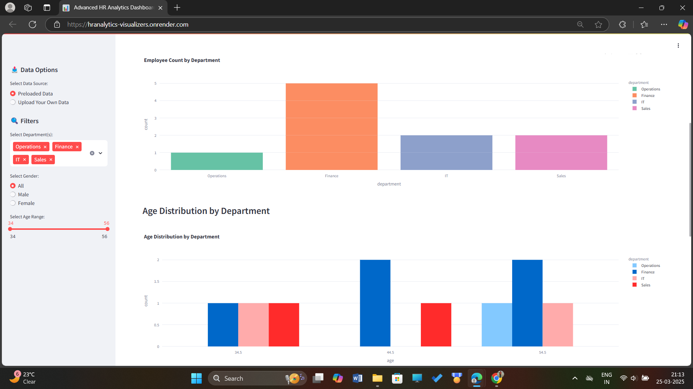
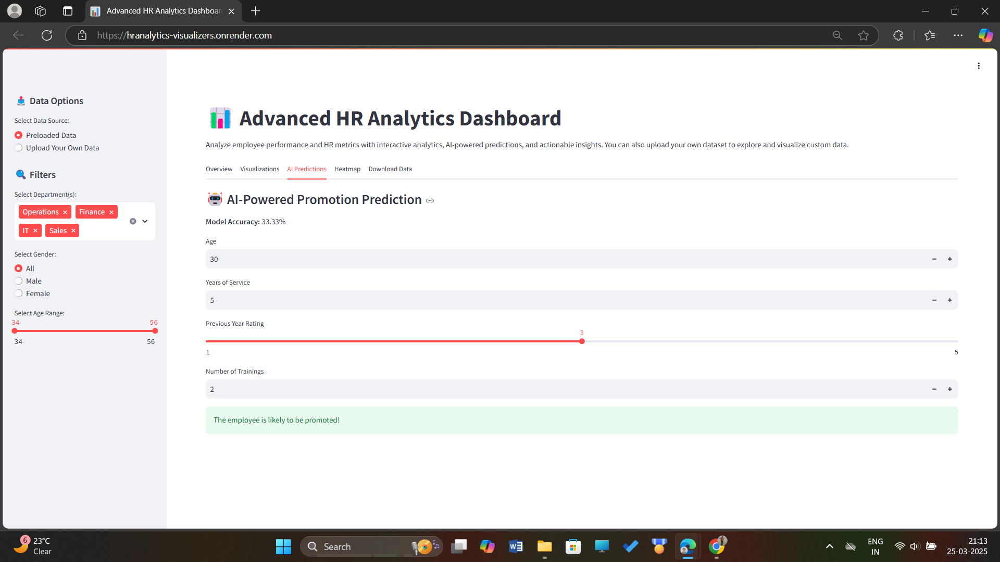

# HR Analytics Dashboard

## 📌 Overview


The HR Analytics Dashboard is an interactive data visualization tool designed to analyze and optimize employee performance, retention, and workforce trends. It provides insights into key HR metrics, helping organizations make data-driven decisions.


## 🔍 Features

- **Employee Performance Analysis** – Visualizes employee performance trends based on key KPIs  
- **Attrition & Retention Insights** – Identifies critical factors contributing to employee turnover  
- **Diversity & Inclusion Metrics** – Analyzes gender, age, and role distributions across departments  
- **Salary & Compensation Analysis** – Compares salary trends across departments and roles  
- **Department-Wise Analytics** – Evaluates department-wise productivity and workforce allocation  
- **Custom Data Upload** – Allows users to upload and analyze their own HR data files  

---

  


---

## 📊 Technologies Used

- **Python** – Core scripting for data processing and automation  
- **Pandas**, **NumPy** – For efficient data manipulation and analysis  
- **Matplotlib**, **Seaborn**, **Plotly** – For advanced visualizations and interactive charts  
- **Power BI** / **Streamlit** – Used for building intuitive dashboards and front-end visual analytics  
- **MySQL** / **PostgreSQL** *(Optional)* – For structured database storage and backend integration  

---

## 📂 Dataset

The dashboard uses HR datasets containing employee-specific information, including:

- Employee ID, Department, and Job Role  
- Salary details and Performance Ratings  
- Work Tenure and Attrition Status  
- Demographic attributes such as Gender, Age, and Years of Experience  

> 📌 *Note: Users can upload custom HR datasets in `.csv` format for real-time analysis*

---

Let me know if you want me to generate a full README from top to bottom, including title, live link badge, setup instructions, and more.


## 🚀 How to Run the Project

Clone the repository:
```
git clone https://github.com/your-username/hr-analytics-dashboard.git
```
Navigate to the project directory:
```
cd hr-analytics-dashboard
```
Install dependencies:
```
pip install -r requirements.txt
```
Run the dashboard:
```
streamlit run app.py
```
OR, for Power BI users:
Open the Power BI file and connect it to the dataset.

## 📈 Insights Gained

- **High Attrition Roles** – Identified job roles with high turnover rates and patterns  
- **Salary & Performance Correlation** – Analyzed how salary impacts employee performance and engagement  
- **Workforce Diversity Trends** – Examined gender and age distribution within various departments  
- **Retention Strategies** – Suggested actionable steps to improve employee satisfaction and reduce attrition  

---

## 📜 Future Improvements

- [ ] **Predictive Analytics** – Implement machine learning models for attrition prediction based on historical HR data  
- [ ] **Automated Report Generation** – Enable dynamic, scheduled generation of HR summary reports  
- [ ] **Advanced Filtering & Drill-Downs** – Allow users to filter dashboards by department, tenure, gender, etc.  
- [ ] **Integration with HRMS** – Connect with enterprise Human Resource Management Systems for real-time insights  


## 🏆 Contributions

Feel free to fork this repository and contribute to improve this project! If you have any suggestions, open an issue or create a pull request.

## Author
Priya Chanchal :)

[](https://github.com/Priya-C-016)  
[](https://www.linkedin.com/in/priya-chanchal-050b86288/)

